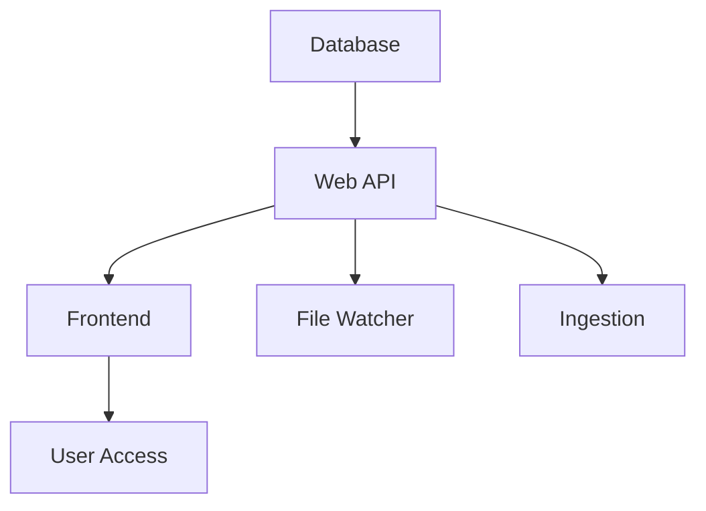

# Astronomy Image Management System

A production-ready, containerized solution for astronomical observatories to automatically ingest, process, and manage FITS (Flexible Image Transport System) image files with comprehensive metadata extraction, role-based authentication, and advanced web-based querying capabilities.


##  Features

-  **Automatic FITS File Ingestion** - Real-time detection and processing with parallel processing
-  **Comprehensive Metadata Extraction** - 40+ astronomical parameters from FITS headers
-  **Advanced Duplicate Prevention** - Multi-level checks prevent duplicate database entries
-  **Sophisticated Web Query Interface** - Advanced filtering with date, temperature, quality, camera, and time range
-  **Google OAuth 2.0 + JWT Authentication** - Secure user authentication with role-based access control
-  **Admin/User Role System** - Admin-only download privileges and user management
-  **Multi-Method File Detection** - Watchdog events + periodic scanning with automatic fallbacks
-  **Quality Assessment System** - Automatic quality scoring and flagging for astronomical images
-  **Admin-Only Download System** - Secure FITS file downloads with ZIP compression
-  **Real-Time File Monitoring** - File stability checking and intelligent processing
-  **OS-Agnostic Design** - Works on Windows, Linux, macOS, and cloud platforms
-  **Production-Ready** - Health checks, connection pooling, and comprehensive logging

##  Quick Start

### Prerequisites

- **Docker Desktop** (Windows/macOS) or **Docker Engine** (Linux)
- **Docker Compose** v2.0+
- **4GB RAM** minimum, 8GB recommended
- **Ports 80 and 3307** available
- **Google Cloud Console** account for OAuth setup

### 1. Clone and Setup

```bash
git clone https://github.com/Knox-College-Computer-Science/Database1.git
cd Database1
```

### 2. Configure Environment

Create a `.env` file in the project root:

```bash
# MySQL Database Configuration
DB_ROOT_PASSWORD=your_secure_root_password
DB_NAME=astrodb
DB_USER=astro
DB_PASSWORD=your_secure_password
HOST_DB_PORT=3307
DB_INTERNAL_PORT=3306

# Application Security (IMPORTANT: Change these!)
JWT_SECRET=your_32_character_secret_key_here_minimum_length_required
GOOGLE_CLIENT_ID=your_google_oauth_client_id_from_console

# Environment Configuration
ENVIRONMENT=development
SERVICE=ingestion

# FITS File Storage Path (CHANGE THIS TO YOUR FITS DIRECTORY!)
LOCAL_IMAGE_PATH=/path/to/your/fits/files

# Production SSL Settings (for production deployment)
DB_SSL_ENABLED=false
DB_SSL_CA=/path/to/your/ca-cert.pem
```

>  **Critical**: Update `LOCAL_IMAGE_PATH` to point to your FITS files directory
> 
>  **Security**: Generate a strong 32+ character JWT_SECRET for production

### 3. Google OAuth Setup

1. Go to [Google Cloud Console](https://console.cloud.google.com)
2. Create a new project or select existing
3. Enable **Google+ API**
4. Configure **OAuth consent screen**
5. Create **OAuth 2.0 Client ID** credentials
6. Add authorized origins:
   - `http://localhost` (development)
   - `https://yourdomain.com` (production)
7. Copy **Client ID** to `GOOGLE_CLIENT_ID` in `.env`

### 4. Start the System

```bash
# Ensure Docker is running first!
docker compose up --build

# Or run in background:
docker compose up --build -d
```

### 5. Access the Application

-  **Web Interface**: http://localhost
-  **API Documentation**: http://localhost/api/docs
-  **Health Check**: http://localhost/api/health
-  **Database**: `mysql -h 127.0.0.1 -P 3307 -u astro -p`

##  System Architecture

### 5-Container Microservices Architecture

| Service | Purpose | Technology | Internal Port | External Port |
|---------|---------|------------|---------------|---------------|
| **frontend** | Web interface & Nginx proxy | HTML/CSS/JS + Nginx | 80 | 80 |
| **web** | REST API & business logic | FastAPI + Python 3.12 | 8000 | - |
| **db** | Astronomical data storage | MySQL 8.0 | 3306 | 3307 |
| **file-watcher** | Real-time FITS monitoring | Python + Watchdog | - | - |
| **ingestion** | Bulk FITS processing | Astropy + Python | - | - |

### Container Dependencies & Health Checks



All containers include comprehensive health checks and automatic restart policies.

### Advanced Database & Processing Architecture

**Database Design Innovations**:
- **Optimized Schema**: Custom-designed tables for astronomical data with 40+ indexed fields
- **Connection Pooling**: Advanced pool management with 20+ worker connections for high throughput
- **Performance Optimization**: Query optimization, connection recycling, and intelligent caching
- **Data Integrity**: Multi-level duplicate prevention and transaction management

**Processing System Features**:
- **Parallel Ingestion**: Thread-pool based processing with configurable worker count (default: 20)
- **Smart File Monitoring**: Hybrid approach using filesystem events + periodic scanning with fallback mechanisms
- **Data Quality Assessment**: Automated scoring algorithms for astronomical image quality
- **Robust Error Handling**: Comprehensive logging, retry mechanisms, and graceful failure recovery

## Project Structure

```
astronomy-image-system/
├── astro_images/app/             # Main Python application
│   ├── main.py                   # FastAPI app & API endpoints
│   ├── models.py                 # SQLAlchemy database models
│   ├── schemas.py                # Pydantic validation schemas
│   ├── database.py               # DB connection & pooling config
│   ├── ingestion.py              # FITS processing & metadata extraction
│   ├── file_watcher.py           # Real-time file monitoring service
│   ├── auth.py                   # JWT token management
│   ├── google_auth.py            # Google OAuth 2.0 integration
│   ├── deps.py                   # Authentication dependencies
│   └── config.py                 # Application configuration
├── frontend/                     # Web frontend
│   ├── index.html                # Main SPA interface
│   ├── app.js                    # Frontend application logic
│   ├── styles.css                # Responsive UI styling
│   └── Dockerfile                # Frontend container config
├── nginx/
│   └── nginx.conf                # API proxy configuration
├── docker-compose.yml            # 5-container orchestration
├── Dockerfile                    # Backend container config
├── requirements.txt              # Python dependencies (40+ packages)
├── .env                          # Environment variables
└── README.md                     # This documentation
```

## Key Features Explained

###  **FITS File Processing**

**Supported Formats**: `.fits`, `.fts`

**Metadata Extraction** (40+ fields):
- Observation data: RA, DEC, DATE-OBS, EXPTIME, OBJECT
- Camera settings: GAIN, TEMP, FILTER, AIRMASS, BITPIX
- Telescope data: TELALT, TELAZ, OBSNAME, INSTRUME
- Quality metrics: Automatic quality scoring and flagging
- Full header preservation as searchable JSON

**Advanced Processing Pipeline**:
1. **File Detection** -> Multi-method watchdog events + intelligent periodic scanning
2. **Stability Check** -> Sophisticated file write completion verification
3. **Duplicate Prevention** -> Multi-layer database and API-level duplicate detection
4. **Metadata Extraction** -> Astropy-based header parsing with coordinate conversion
5. **Data Processing** -> Advanced quality assessment with automatic scoring algorithms
6. **Database Integration** -> Parallel threaded processing with connection pooling and optimized storage

###  **Authentication & Authorization**

**Google OAuth 2.0 Flow**:
1. User clicks "Sign in with Google"
2. Google Identity Services handles authentication
3. Backend verifies token and creates/updates user
4. JWT token issued for subsequent API calls
5. Role-based access control enforced

**User Roles**:
-  **Regular Users**: Can query and filter images
-  **Administrators**: Full access + download privileges + user management

**First User**: Automatically becomes admin; subsequent users are regular users.

###  **Advanced Web Interface**

**Query & Filter System**:
-  Date picker for specific observation dates
-  Temperature range filtering (min/max °C)
-  Quality score filtering (0-100%)
-  Camera name search
-  Observatory/telescope filtering
-  Time range filtering (start/end times)
-  Advanced search dropdown with filter suggestions

**Admin Features**:
-  Bulk download as ZIP files (FITS files only)
-  User management interface
-  Role assignment capabilities

##  API Reference

### Authentication Endpoints

```bash
# Google OAuth Login
POST /api/auth/google
Content-Type: application/json
{
  "token": "google_id_token"
}

# Get Current User Info
GET /api/user/me
Authorization: Bearer <jwt_token>
```

### Image Query Endpoints

```bash
# List Images with Filters
GET /api/images
Query Parameters:
  - date: YYYY-MM-DD (exact date)
  - min_temp, max_temp: Temperature range (°C)
  - min_quality: Quality score threshold (0-100)
  - camera: Camera name filter
  - telescope: Observatory filter
  - start_time, end_time: Time range (HH:MM)
  - limit: Max results (default: 1000)
  - offset: Pagination offset

# Get Specific Image
GET /api/images/{image_id}

# Download FITS File (Admin Only)
GET /api/images/{image_id}/download
Authorization: Bearer <admin_jwt_token>
```

### Admin Endpoints

```bash
# List All Users (Admin Only)
GET /api/admin/users
Authorization: Bearer <admin_jwt_token>

# Update User Permissions (Admin Only)
PUT /api/admin/users/{user_id}
Authorization: Bearer <admin_jwt_token>
{
  "is_admin": true,
  "is_active": true
}
```

## FITS File Management

### Adding New Files

**Development (Local)**:
```bash
# Copy FITS files to monitored directory
cp /source/observations/*.fits /your/LOCAL_IMAGE_PATH/
```

**Production (Server)**:
```bash
# Upload via SCP
scp *.fits user@server:/opt/astronomy/images/

# Bulk transfer with rsync
rsync -av --progress *.fits user@server:/opt/astronomy/images/
```

### File Detection Methods

1. **Real-time Events** (Primary): Watchdog filesystem events
2. **Periodic Scanning** (Backup): Every 5-30 seconds
3. **Manual Ingestion** (Fallback): CLI commands

**Processing Flow**:
- File added -> Detected within 5-30 seconds -> Stability check -> Metadata extraction -> Database storage -> Immediately queryable

### Manual Operations

```bash
# Manual bulk ingestion
docker exec database1-ingestion-1 python -m astro_images.app.ingestion

# Process specific directory
docker exec -e LOCAL_IMAGE_PATH=/new/path database1-web-1 python -c "
from astro_images.app.ingestion import upload_all
upload_all()
"

# Check ingestion status
docker logs database1-file-watcher-1 -f
```

## Troubleshooting

### Common Issues

#### **File Detection Not Working**

**Symptoms**: New FITS files not appearing in web interface

**Diagnostic Steps**:
```bash
# 1. Check file watcher logs
docker logs database1-file-watcher-1 -f

# 2. Verify file permissions and extensions
ls -la /your/LOCAL_IMAGE_PATH/*.{fits,fts}

# 3. Test manual ingestion
docker exec database1-web-1 python -c "
from astro_images.app.ingestion import upload_all
upload_all()
"

# 4. Check database connectivity
docker exec database1-web-1 python -c "
from astro_images.app.database import check_database_health
print('DB Health:', check_database_health())
"
```

**Solutions**:
- Ensure `LOCAL_IMAGE_PATH` in `.env` is correct
- Check file extensions are `.fits` or `.fts`
- Verify Docker volume mounting
- Restart file-watcher: `docker restart database1-file-watcher-1`

#### **Authentication Issues**

**Problem**: Google sign-in not working

**Solutions**:
1. Verify `GOOGLE_CLIENT_ID` in `.env`
2. Check Google Cloud Console OAuth settings
3. Ensure authorized origins include your domain
4. Clear browser cache and cookies
5. Check browser console for JavaScript errors

#### **Database Connection Problems**

**Symptoms**: API returning 500 errors, health check failing, ingestion failures

**Advanced Diagnostic Commands**:
```bash
# Check all service status
docker compose ps

# Database logs and connection analysis
docker logs database1-db-1 -f

# Test direct database connection with authentication
mysql -h 127.0.0.1 -P 3307 -u astro -p${DB_PASSWORD}

# API backend logs and error analysis
docker logs database1-web-1 -f

# Database connection pool monitoring
docker exec database1-web-1 python -c "
from astro_images.app.database import get_pool_status, check_database_health
print('DB Health:', check_database_health())
print('Pool Status:', get_pool_status())
"

# Test backend integration
curl -H "Content-Type: application/json" http://localhost/api/health
```

**Backend Integration Fixes**:
- Verify environment variables are properly configured in all containers
- Check API wait times and timeout configurations
- Ensure proper database schema migrations and table creation
- Validate connection pooling settings and worker thread allocation

#### **Port Conflicts**

**Problem**: Ports 80 or 3307 already in use

**Solution**: Update `docker-compose.yml`:
```yaml
services:
  frontend:
    ports:
      - "8080:80"  # Use port 8080 instead
  db:
    ports:
      - "3308:3306"  # Use port 3308 instead
```

### Database Operations

```sql
-- Connect to database
mysql -h 127.0.0.1 -P 3307 -u astro -p

-- Useful queries
SHOW DATABASES;
USE astrodb;
SHOW TABLES;

-- Check data
SELECT COUNT(*) FROM images;
SELECT COUNT(*) FROM users;
SELECT * FROM images ORDER BY ingest_time DESC LIMIT 5;

-- User management
SELECT user_id, email, display_name, is_admin, is_active FROM users;

-- Quality statistics
SELECT 
  COUNT(*) as total_images,
  AVG(quality_score) as avg_quality,
  COUNT(CASE WHEN quality_flag = 1 THEN 1 END) as high_quality_count
FROM images;
```

### Monitoring & Logs

```bash
# All services logs
docker compose logs -f

# Specific service logs
docker logs database1-web-1 -f
docker logs database1-file-watcher-1 -f
docker logs database1-db-1 -f

# Error tracking
docker compose logs --since=1h | grep -i error

# Performance monitoring
docker stats

# Database connection pool status
docker exec database1-web-1 python -c "
from astro_images.app.database import get_pool_status
print(get_pool_status())
"
```

## Development

### Local Development Setup

```bash
# Create Python virtual environment
python -m venv .venv

# Activate environment
# Windows:
.venv\Scripts\activate
# Linux/macOS:
source .venv/bin/activate

# Install dependencies
pip install -r requirements.txt

# Start development containers
docker compose up --build
```

### Environment Configuration

| Variable | Required | Default | Description |
|----------|----------|---------|-------------|
| `LOCAL_IMAGE_PATH` | YES | - | Path to FITS files directory |
| `DB_PASSWORD` | YES | - | MySQL password |
| `JWT_SECRET` | YES | - | JWT signing secret (32+ chars) |
| `GOOGLE_CLIENT_ID` | YES | - | Google OAuth client ID |
| `ENVIRONMENT` | NO | `development` | Environment mode |
| `HOST_DB_PORT` | NO | `3307` | External database port |
| `DB_SSL_ENABLED` | NO | `false` | Enable SSL for production |

### Production Deployment

**Environment Updates for Production**:
```bash
# Update .env for production
ENVIRONMENT=production
DB_SSL_ENABLED=true
DB_SSL_CA=/path/to/ca-cert.pem

# Update allowed origins in main.py
allowed_origins = [
    "https://yourdomain.com",
    "https://www.yourdomain.com",
]
```

**Security Checklist**:
- [ ] Strong JWT_SECRET (32+ characters)
- [ ] Secure database passwords
- [ ] HTTPS enabled
- [ ] Database SSL configured
- [ ] Google OAuth origins restricted to production domain
- [ ] Firewall configured (ports 80, 443 only)

## Dependencies

### Core Technologies

**Backend** (`requirements.txt` - 40+ packages):
- `fastapi==0.115.12` - Modern web framework
- `uvicorn==0.34.2` - ASGI server
- `sqlalchemy==2.0.40` - Database ORM
- `pymysql==1.1.1` - MySQL connector
- `astropy==7.0.1` - Astronomical data processing
- `watchdog==6.0.0` - File system monitoring
- `google-auth==2.35.0` - Google OAuth integration
- `pyjwt==2.10.1` - JWT token handling
- `pydantic==2.11.3` - Data validation

**Frontend**:
- Vanilla JavaScript (ES6+)
- Google Identity Services
- JSZip for download functionality
- Responsive CSS with animations

## Quick Reference

### Essential Commands

```bash
# System Management
docker compose up --build             # Start all services
docker compose down                   # Stop all services
docker compose restart file-watcher   # Restart specific service
docker system prune -f                # Clean up Docker resources

# Monitoring
docker compose logs -f                 # All logs
docker compose ps                      # Service status
curl http://localhost/api/health       # Health check

# Manual Operations
docker exec database1-web-1 python -c "from astro_images.app.ingestion import upload_all; upload_all()"
mysql -h 127.0.0.1 -P 3307 -u astro -p  # Database access

# Troubleshooting
docker compose logs --since=1h | grep -i error  # Recent errors
docker stats                                    # Resource usage

#validation tests
docker-compose exec web curl "http://localhost:8000/api/images?telescope=Winer%20Observatory&limit=2"
docker-compose exec web curl "http://localhost:8000/api/images?min_temp=-10&limit=2"  
docker-compose exec web curl "http://localhost:8000/api/images?filter_name=lrg&limit=2"
```

### Service URLs

- **Main Application**: http://localhost
- **API Documentation**: http://localhost/api/docs
- **Health Endpoint**: http://localhost/api/health
- **Database**: `127.0.0.1:3307`

---

## Team: Planet of the APIs

**Spring 2025 Software Engineering Project**

- **Dheer G.** - Backend Architecture, Database Design, Docker Infrastructure, Data Extraction, API Fixes
- **James N.** - Docker Infrastructure, Database Models & Schema Implementation
- **Andree V.** - API Development & Business Logic
- **Vyaas S.** - Frontend UI & User Authentication
- **Zach S.** - Data Extraction & Documentation, API Integration

---

*For additional documentation, deployment guides, or support, please refer to the project repository or contact the development team.*